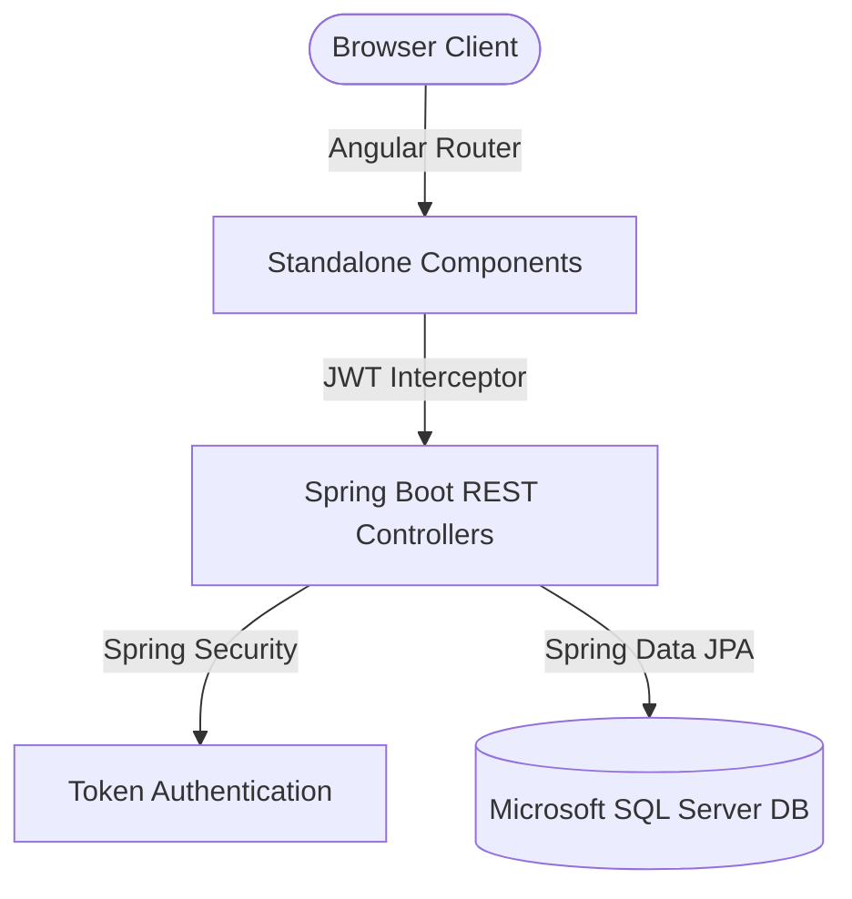

# Dokumentasi Pengembangan & Penggunaan AI — Proyek Ariel

Dokumen ini mendokumentasikan secara komprehensif mengenai seluruh proses rekayasa perangkat lunak, teknologi yang digunakan, keputusan arsitektur, peran kecerdasan buatan (AI), serta langkah-langkah detail pengerjaan dari awal hingga pemolesan akhir UI/UX pada sistem manajemen tugas **Ariel** (sebelumnya bernama *TaskFlow*).

---

## 1. Arsitektur & Spesifikasi Sistem

Sistem manajemen tugas **Ariel** adalah aplikasi berbasis web dengan arsitektur modern (Full-Stack decoupled) yang dirancang untuk mendukung operasional perusahaan berskala premium dengan fitur manajemen berbasis peran (*role-based access control*).

### A. Backend (Spring Boot 3)
* **Framework**: Spring Boot 3.x
* **Security & Auth**: Spring Security 6.x dengan sistem otentikasi berbasis Stateless JWT (JSON Web Token).
* **Database Access**: Spring Data JPA dengan dukungan migrasi skema dan seed data SQL Server.
* **Database Engine**: Microsoft SQL Server (dijalankan via Docker).
* **Prinsip Desain**: Mengikuti **Ponytail Principles** (fokus pada minimalisasi boilerplate, penanganan error terpusat melalui `@RestControllerAdvice`, dan kepatuhan tinggi terhadap kebersihan kode).

### B. Frontend (Angular)
* **Framework**: Angular 22.0.x (Standalone Components)
* **State Management**: Memanfaatkan Angular **Signals** (`signal`, `computed`) untuk reaktivitas antarmuka yang cepat dan hemat memori.
* **Styling**: Tailwind CSS v4.x melalui `@tailwindcss/postcss` untuk layout utilitas modern, dikombinasikan dengan Vanilla CSS untuk visual bergaya Notion.
* **Desain Visual**: Mengusung estetika minimalis Notion (Light Theme) dengan palet warna abu-abu arang (`#37352f`) dan latar belakang putih bersih (`#ffffff`), transisi mikro-interaksi halus, serta **larangan keras penggunaan raw emoji untuk lambang** (sepenuhnya memakai ikon vektor outline SVG).

---

## 2. AI Tools yang Digunakan & Rationale

* **AI Tool**: Gemini 3.5 Flash (diakses melalui Antigravity IDE Agent).
* **Alasan Penggunaan**:
  - **Pemahaman Konteks Dokumen**: Mampu mengekstraksi dan menafsirkan spesifikasi sistem dari dokumen PRD yang diunggah pengguna secara akurat.
  - **Bantuan Pemrograman Berpasangan (Pair Programming)**: Mengakselerasi pembuatan kode backend (Repository, Service, Controller) dan frontend (Signals, Angular Template Control Flow `@if`/`@for`).
  - **Audit Kode Otomatis**: Memastikan tidak ada kode boilerplate yang berlebihan sesuai prinsip efisiensi ponytail.
  - **Pencegahan Redundansi**: Memetakan struktur file secara logis sebelum menulis perubahan.

---

## 3. Model Kolaborasi & Pembagian Kerja (Pair Programming)

Dalam pengembangan proyek Ariel ini, pengerjaan dilakukan dengan model kolaborasi aktif (*Pair Programming*) antara Pengguna dan AI. Model ini memastikan kode yang dibangun menggabungkan rancangan arsitektur dan sistem penanganan dari pengguna dengan optimalisasi penulisan otomatis:

* **Kontribusi Pengguna (Architect & Logic Designer)**:
  - Merancang struktur data awal, model bisnis, skema database, DTO (seperti `RegisterRequest`), Entity, serta Service fungsional di luar workspace utama.
  - Menyusun dasar-dasar mekanisme keamanan, integrasi API endpoints pada Controller, penanganan error global (*global error handler*), serta sistem validasi input data menggunakan Jakarta Validation (`jakarta.validation`).
  - Memberikan arahan kebutuhan visual (Notion-style layout, penyelarasan border pembatas, pemisahan tulisan modal *New Task* dan *Edit Task*).
  - Melakukan review kode untuk menjaga kesesuaian produk akhir dengan rancangan awal.
* **Kontribusi AI (Optimizer & Refactoring Agent)**:
  - Menganalisis rancangan awal pengguna dan memolesnya menggunakan pendekatan **Ponytail Principles** untuk menghasilkan versi kode yang jauh lebih sederhana, bersih, dan mudah dibaca tanpa mengorbankan fungsionalitas.
  - Menyederhanakan penulisan data transfer object dengan mengeliminasi getter dan setter manual menggunakan anotasi Lombok (seperti `@Getter`, `@Setter`, `@Data`).
  - Menyederhanakan routing, penanganan error, validasi Jakarta, dan filter keamanan dengan memanfaatkan konfigurasi anotasi Spring Boot (`@RestController`, `@Service`, `@Autowired`, `@Repository`, dll.) secara efisien.
  - Membantu debugging serta perbaikan kesalahan kompilasi (*compile errors*) agar kode frontend (Angular 22) dan backend (Spring Boot 3) dapat berinteraksi secara aman.

---

## 4. Langkah-Langkah Pengerjaan & Prompt Detil

Proyek ini diselesaikan melalui 5 fase bertahap dari pemahaman spesifikasi hingga penyesuaian UI:

### Tahap 1: Analisis Spesifikasi Bisnis & Teknis
* **Langkah**: AI menganalisis dokumen spesifikasi file PRD untuk menentukan batasan fungsional, aturan peran (Admin vs. User), kebutuhan API, skema DB, penanganan exception, dan larangan khusus.
* **Prompt**: *"coba baca file PRD ini, jika kamu bisa membacanya dan memahami nya maka beritahu aku. jangan lakukan apapun oke selain memberitahuku jika kamu bisa baca dan paham isinya"*
* **Hasil**: Rangkuman arsitektur, parameter koneksi, kebutuhan validasi (panjang karakter minimum input), dan batasan desain UI.

### Tahap 2: Verifikasi Lingkungan (Environment Check)
* **Langkah**: Memastikan perkakas pengembangan pada WSL (Windows Subsystem for Linux) pengguna siap menjalankan proyek Spring Boot & Angular 22.
* **Prompt**: *"oke mari bicarakan tech stacknya? bagaimana? aku akan melakukan perintah perintah di terminal untuk melakukan checking, apa saja yang harus aku check untuk bisa membuat project ini? sebagai catatan aku membuat nya di wsl"*
* **Hasil**: Hasil pemeriksaan dibagikan oleh pengguna: JDK 25, Maven 3.9.12, Node 24.16.0, Angular CLI 22.0.3, Docker 29.5.3.

### Tahap 3: Pembuatan Rencana Implementasi (Implementation Plan)
* **Langkah**: Pembuatan draf struktur folder proyek, detail skema database SQL Server, arsitektur keamanan JWT, struktur component frontend, dan metode verifikasi.
* **Prompt**: *"1. port for Microsoft SQL Server you can setup by default and must use microsoft SQL Server. 2. i have no spesific admin credentials. 3. always use ponytail skills to create efficient code"*
* **Hasil**: Pembuatan file rencana kerja terpusat: `implementation_plan.md` dan pelacak tugas: `task.md`.

### Tahap 4: Inisialisasi Database & Backend Spring Boot 3
* **Langkah**: Penulisan konfigurasi Spring Boot, update skema tabel SQL Server, pembuatan data dummy pengguna, update logic JWT token provider, validasi filter keamanan, pembuatan unit test, update penanganan error global, serta integrasi API endpoints.
* **Hasil**:
  - Database: [docker-compose.yml](file:///home/bl4ck/home/jakarta/docker-compose.yml) (koneksi SQL Server port 1433) & [schema.sql](file:///home/bl4ck/home/jakarta/schema.sql) (tabel `users` dan `tasks`).
  - Backend: Rest API modular yang mendukung CRUD tasks, pencarian teks, filtering status, serta otentikasi terenkripsi yang efisien.

### Tahap 5: Rebranding Ariel & Notion UI/UX Polish
* **Langkah**: Mengubah identitas produk dari "TaskFlow" menjadi "Ariel" di seluruh basis data, sistem konfigurasi, dan UI. Mengubah antarmuka menjadi minimalis light theme bergaya Notion. Mengintegrasikan UI Toast, transisi animasi `<dialog>`, dan modernisasi Angular control flow.
* **Hasil**:
  - Rebranding: Domain email pengguna awal diubah menjadi `@ariel.com` dengan password default terenkripsi `Ariel@Password123!`.
  - UI/UX & SEO: Integrasi font premium Inter di [index.html](file:///home/bl4ck/home/jakarta/frontend/src/index.html), styling scrollbar ramping dan animasi dialog di [styles.css](file:///home/bl4ck/home/jakarta/frontend/src/styles.css), serta implementasi papan Kanban 3 kolom di [task-list.html](file:///home/bl4ck/home/jakarta/frontend/src/app/components/task-list/task-list.html). Semua ikon lama diganti dengan kode SVG Outline murni.

---

## 5. Kepatuhan Aturan & Validasi Proyek

Selama siklus pengembangan, sistem secara konsisten memenuhi batasan-batasan teknis berikut:
* **Larangan Emoji**: Seluruh elemen visual, tombol, logo, status pills, dan empty state murni menggunakan representasi grafis SVG Vector Outline.
* **Minimalisme Fungsional**: Implementasi meminimalisasi penggunaan pustaka pihak ketiga berlebih, memanfaatkan kemampuan bawaan Angular (Signals & standalone routing) dan Spring Boot secara optimal.
